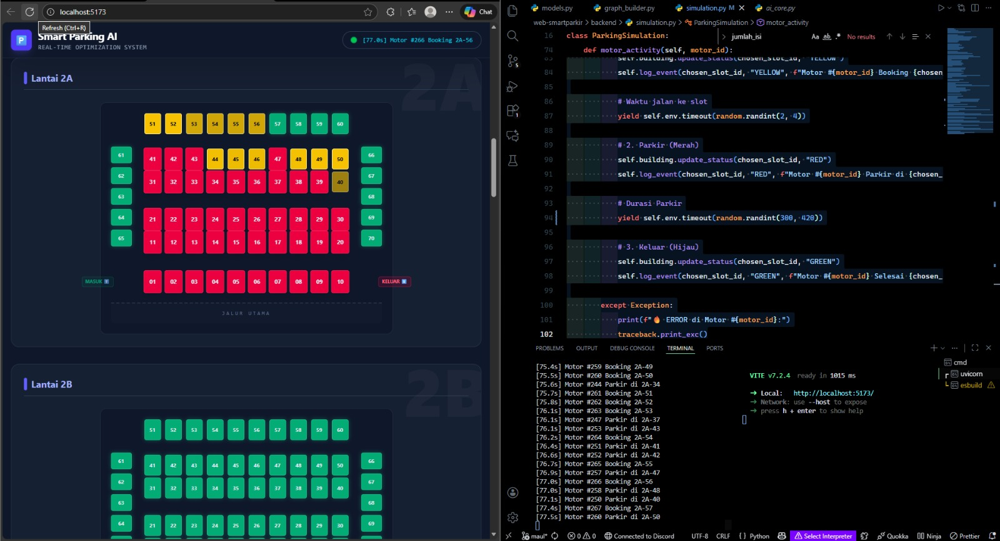

# 🅿️ Smart Parking AI Simulation


> **Sistem Simulasi Parkir Cerdas Berbasis Web dengan Algoritma A\* (Pathfinding) dan Visualisasi Real-Time.**

Proyek ini adalah simulasi sistem manajemen parkir gedung bertingkat (Universitas Pendidikan Indonesia) yang menggunakan kecerdasan buatan untuk mengoptimalkan alokasi slot parkir. Sistem ini mendemonstrasikan bagaimana agen otonom (kendaraan) mencari rute terpendek di lingkungan yang dinamis dan padat.

---

## 🌟 Fitur Utama

- **🧠 Intelligent Pathfinding (A\* Algorithm):** Menggunakan algoritma A-Star dengan logika _Priority Floor Search_ untuk mencari slot parkir terdekat dan termurah, memprioritaskan lantai bawah sebelum mengisi lantai atas.
- **⚡ Real-Time Visualization:** Sinkronisasi instan antara Backend (Python) dan Frontend (Vue.js) menggunakan **WebSocket**, memungkinkan pemantauan status slot (Kosong, Booking, Terisi) tanpa delay.
- **🏢 Multi-Level Simulation:** Mendukung struktur gedung 14 tingkat (B, 1A-7A) dengan kapasitas total **980 slot** (70 slot/lantai).
- **📈 High Concurrency (Stress Test):** Mampu menangani antrian hingga **500+ kendaraan** secara simultan menggunakan _Event-Driven Architecture_ (SimPy).
- **🔄 Realistic Environment:** Fitur **Pre-filling** mensimulasikan kondisi parkiran yang sudah terisi sebagian secara acak saat sistem pertama kali dinyalakan.
- **📍 Dynamic Zoning:** Pembagian zona parkir (Depan, Tengah, Belakang, Sayap) dengan bobot biaya yang berbeda untuk simulasi preferensi manusia.

---

## 🛠️ Teknologi yang Digunakan

### Backend (Server Logic)

- **Python:** Bahasa pemrograman utama.
- **FastAPI:** Framework web modern untuk API dan WebSocket server.
- **SimPy:** Pustaka simulasi kejadian diskrit (_discrete-event simulation_) untuk memodelkan waktu dan antrian.
- **NetworkX:** Pustaka untuk membangun Graph dan kalkulasi rute terpendek (A\*).

### Frontend (User Interface)

- **Vue.js 3:** Framework JavaScript reaktif untuk antarmuka pengguna.
- **Tailwind CSS:** Utility-first CSS framework untuk styling modern.
- **WebSocket API:** Protokol komunikasi dua arah real-time.

---

## 🚀 Panduan Instalasi dan Menjalankan Aplikasi

Ikuti langkah-langkah berikut untuk menjalankan sistem di komputer lokal Anda.

### A. Konfigurasi Backend (Server)

1.  Buka terminal dan masuk ke folder `backend`:
    ```bash
    cd backend
    ```
2.  Instal seluruh dependensi yang diperlukan:
    ```bash
    pip install fastapi uvicorn simpy networkx websockets
    ```
3.  Jalankan server simulasi:
    ```bash
    uvicorn main:app --reload
    ```
    ✅ _Pastikan muncul pesan `Application startup complete` di terminal._

### B. Konfigurasi Frontend (UI)

1.  Buka terminal baru (terminal backend jangan ditutup), lalu masuk ke folder `frontend`:
    ```bash
    cd frontend
    ```
2.  Instal dependensi Node.js (jika belum):
    ```bash
    npm install
    ```
3.  Jalankan server frontend:
    ```bash
    npm run dev
    ```

### C. Akses Aplikasi

Buka browser Anda dan kunjungi alamat berikut:
👉 **http://localhost:5173/**

---

## 📸 Dokumentasi & Screenshot

Berikut adalah gambaran hasil implementasi sistem:

| Fitur                 | Deskripsi                                                                    |
| :-------------------- | :--------------------------------------------------------------------------- |
| **Real-Time Sync**    | Visualisasi perubahan warna slot (Hijau -> Kuning -> Merah) secara langsung. |
| **Pre-filled Slots**  | Kondisi awal gedung yang sudah terisi slot merah secara acak.                |
| **Pathfinding Logic** | Lantai bawah (B, 1A) penuh terlebih dahulu sebelum motor naik ke 2A.         |



---

## 🧠 Cara Kerja Sistem

1.  **Graph Construction:** Saat inisialisasi, `graph_builder.py` memetakan seluruh gedung menjadi Node dan Edge. Slot dekat pintu diberi bobot kecil, slot jauh/lantai atas diberi bobot besar.
2.  **Motor Generator:** `simulation.py` membangkitkan agen motor setiap 0.05 detik.
3.  **Decision Making:** Setiap motor menggunakan fungsi `find_best_slot_astar()` untuk menghitung rute termurah dari Gerbang Masuk ke slot kosong yang tersedia.
4.  **State Management:** Status slot disimpan di `models.py` dan disiarkan ke frontend melalui WebSocket di `main.py`.

---

## 🔮 Rencana Pengembangan (Future Work)

- [ ] **Heatmap Dashboard:** Analisis visual area parkir yang paling sering penuh.
- [ ] **IoT Integration:** Mengganti generator acak dengan input sensor fisik/kamera.
- [ ] **Multi-Vehicle Types:** Dukungan slot khusus untuk Mobil dan EV (Electric Vehicle).

---

## 📝 Author

- **[Muhammad Maulana Adrian 2408647]**
- **[Zharfan Faza Wibawa 2403995]**
- **[Zufar Ahmad Maulidy 2400285]**
- **[Muhammad Fittra Novria Rizky 2411481]**
Universitas Pendidikan Indonesia (UPI)
_Mata Kuliah Kecerdasan Buatan (AI)_

---
